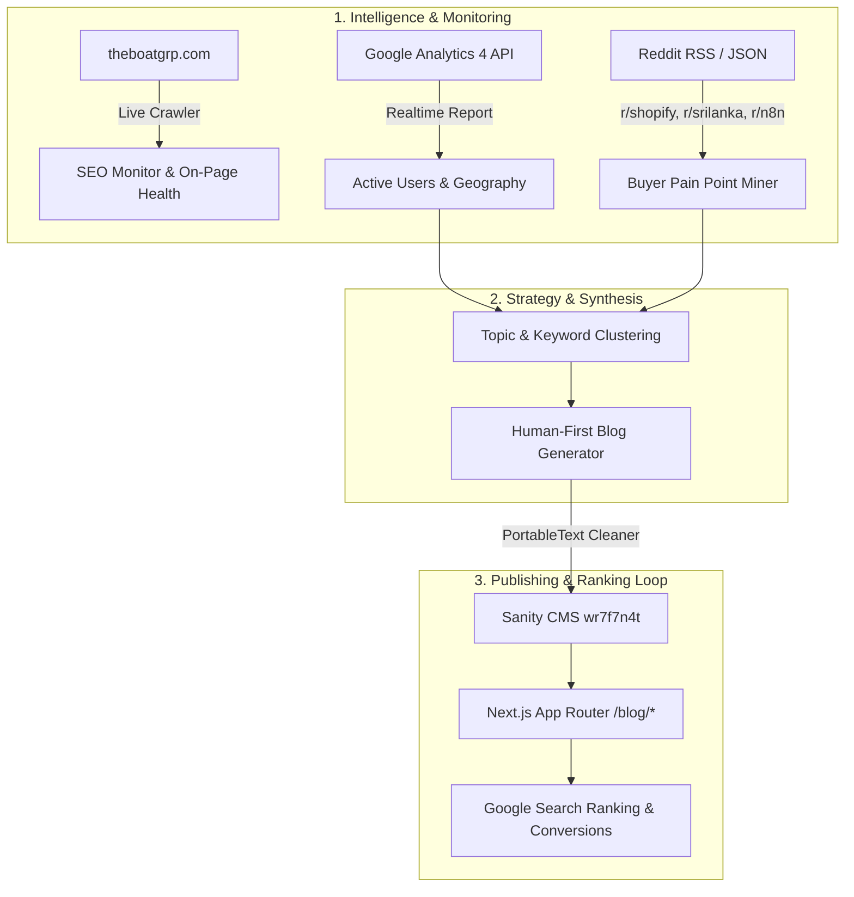

# theBOAT — Complete SEO, Analytics & Reddit Content Pipeline Guide

This guide documents the end-to-end architecture, environment configuration, and single-command execution workflow to replicate the entire SEO monitoring, Google Analytics real-time integration, Reddit topic intelligence, and Sanity automated publishing engine.

---

## ⚡ Quick Start (Single Command)

Run the entire pipeline (Live GA4 check + Reddit mining + Human-first blog generation + Sanity publish):

```bash
# Run full pipeline with 1 command:
npm run pipeline:publish
```

Or run individual sub-modules:
```bash
# 1. Pull Real-Time GA4 Site Activity
npm run analytics:realtime

# 2. Mine Reddit for Live Buyer Pain Points & Questions
npm run reddit:mine

# 3. Generate Human-First SEO Blog Post
npm run blog:generate

# 4. Publish Directly to Sanity CMS
npm run blog:publish
```

---

## 🛡️ Core Automation Rules (Enforced Programmatically)

The pipeline strictly checks and enforces 3 non-negotiable rules on every run:

1. **RULE 1: Zero Keyword Cannibalization**
   - Before drafting or publishing, `src/lib/topic_memory.ts` inspects all 16+ live Sanity posts.
   - Any topic sharing an existing slug, exact primary keyword, or >75% title intent overlap is rejected and skipped.

2. **RULE 2: Mandatory Commercial & Proof-of-Work Links**
   - Every generated article MUST contain direct clickable links to:
     - [`https://theboatgrp.com/stores`](https://theboatgrp.com/stores) (Live client stores proof)
     - Relevant service landing page (`/shopify-development-sri-lanka`, `/services/ai-automation`, or `/services/web-development-colombo`)
     - Concrete case study (`/work/finpilot`, `/work/hima`, etc.).

3. **RULE 3: Instant Sub-48-Hour Indexation Freshness**
   - Each batch publish automatically triggers a Google Search sitemap ping (`https://www.google.com/ping?sitemap=https://theboatgrp.com/sitemap.xml`) notifying Googlebot of the updated `sitemap.xml` for rapid crawling.

---

## 🏗️ Architecture & What Each Component Does



---

## 📋 Step-by-Step Replication Checklist

### Step 1: Environment Variables Configuration
Ensure your `.env.local` contains the following keys:

```bash
# 1. Sanity CMS Credentials
NEXT_PUBLIC_SANITY_PROJECT_ID=wr7f7n4t
NEXT_PUBLIC_SANITY_DATASET=theboat
SANITY_API_WRITE_TOKEN=<your-sanity-write-token>

# 2. Google OAuth Tokens (Connected to buildarealgreatsite@gmail.com)
GOOGLE_CLIENT_ID=<your-google-client-id>.apps.googleusercontent.com
GOOGLE_CLIENT_SECRET=<your-google-client-secret>
GOOGLE_REFRESH_TOKEN=<your-google-refresh-token>

# 3. Google Analytics 4 (GA4) Configuration
NEXT_PUBLIC_GA_MEASUREMENT_ID=G-9TEEYD4B1K
GA4_STREAM_ID=15503785410
GA4_PROPERTY_ID=551670172
```

---

### Step 2: Google Analytics Real-Time Tracking & Data Extraction

1. **Client-Side Live Tagging**:
   - Implemented via `@next/third-parties/google` in `src/app/layout.tsx`.
   - Automatically activates when `NEXT_PUBLIC_GA_MEASUREMENT_ID` is present.
   - Client helper utility in `src/lib/analytics.ts` provides `trackEvent()` and `trackConversion()`.

2. **Server-Side Real-Time Data API**:
   - `src/lib/ga4.ts`: Directly queries `https://analyticsdata.googleapis.com/v1beta/properties/{propertyId}:runRealtimeReport`.
   - API Endpoint: `GET /api/analytics/realtime`
   - CLI Tool: `scripts/fetch_ga4_realtime.mjs` (`npm run analytics:realtime`).

---

### Step 3: Reddit Pain-Point & Keyword Mining

1. **How it works**:
   - `scripts/reddit_keyword_miner.mjs` queries real-time discussions across key buyer subreddits (`r/shopify`, `r/ecommerce`, `r/n8n`, `r/automation`, `r/srilanka`, `r/smallbusiness`).
   - Uses Reddit's Atom/RSS feeds with custom User-Agents to prevent 403 blocks with **$0 cost**.
   - Filters and deduplicates posts based on question syntax, engagement, and category.
   - Saves clean datasets to `data/reddit_intelligence.json`.

2. **Commands**:
   ```bash
   # Scan all pillars
   npm run reddit:mine

   # Scan specific cluster
   node scripts/reddit_keyword_miner.mjs --topic automation
   node scripts/reddit_keyword_miner.mjs --topic shopify
   node scripts/reddit_keyword_miner.mjs --topic ai_agents
   node scripts/reddit_keyword_miner.mjs --topic sri_lanka
   ```

---

### Step 4: Human-First SEO Blog Generation

1. **Editorial Guidelines (Strict Anti-AI Rules)**:
   - **Zero Em-Dashes (`—`)**: Replaced with clean colons or commas.
   - **Zero Bold Markdown Clutter (`**...**`)**: Natural prose without bold list prefixes.
   - **Zero Generic AI Clichés**: No *"In today's fast-paced world"*, *"delve"*, *"game-changer"*, or *"here is the blueprint"*.
   - **Concrete Practitioner Context**: Real Colombo operations, local gateways (PayHere, WebXPay, Koko), banks (Commercial Bank, Sampath, HNB), courier workflows (Domex, Prompt Xpress), and actual LKR numbers.
   - **Internal Linking**: Explicit links to [`https://theboatgrp.com/shopify-development-sri-lanka`](https://theboatgrp.com/shopify-development-sri-lanka), [`https://theboatgrp.com/stores`](https://theboatgrp.com/stores), and case studies.

2. **Command**:
   ```bash
   npm run blog:generate
   ```
   *Generates Markdown files inside `content/blogs/`.*

---

### Step 5: 1-Click Publishing to Sanity CMS

1. **How it works**:
   - `scripts/publish_to_sanity.mjs` reads the generated markdown file.
   - Converts headings, bullet lists, and markdown links (`[Text](href)`) into clean, structured **Sanity PortableText** with `link` annotations (`markDefs`).
   - Pushes or updates the document directly in the `theboat` dataset.

2. **Command**:
   ```bash
   npm run blog:publish
   ```

---

## 📂 File Structure Overview

```
tehBOAT web/
├── .env.local                                # Project credentials & API tokens
├── SEO_GROWTH_PIPELINE_GUIDE.md              # This replication guide
├── data/
│   └── reddit_intelligence.json             # Mined buyer questions & topics
├── content/
│   └── blogs/
│       └── how-to-set-up-shopify-in-sri-lanka...md
├── scripts/
│   ├── run_growth_pipeline.mjs               # Master 1-command pipeline
│   ├── fetch_ga4_realtime.mjs                # GA4 realtime traffic extractor
│   ├── reddit_keyword_miner.mjs              # Reddit feed & question scraper
│   ├── create_seo_blog.mjs                   # Human-first SEO blog generator
│   ├── publish_to_sanity.mjs                 # Sanity PortableText auto-publisher
│   └── connect_google_account.mjs            # Google OAuth reconnect tool
└── src/
    ├── app/
    │   ├── layout.tsx                        # GA4 GoogleAnalytics injection
    │   ├── studio/                           # Embedded Sanity Studio GUI
    │   └── api/
    │       └── analytics/realtime/route.ts   # Live Realtime Analytics API
    └── lib/
        ├── analytics.ts                      # Client-side custom event tracking
        ├── ga4.ts                            # Server-side GA4 Data API client
        └── reddit.ts                         # Modular Reddit intelligence utilities
```

---

## 💰 100% Zero-Cost Guarantee

- **Google Search Console**: $0.00 / month
- **Google Analytics 4**: $0.00 / month (up to 10M events)
- **Reddit API / RSS**: $0.00 / month
- **Sanity CMS Community Tier**: $0.00 / month (up to 100k API requests & 500k documents)
- **Total Operational Cost**: **$0.00 Permanently**
